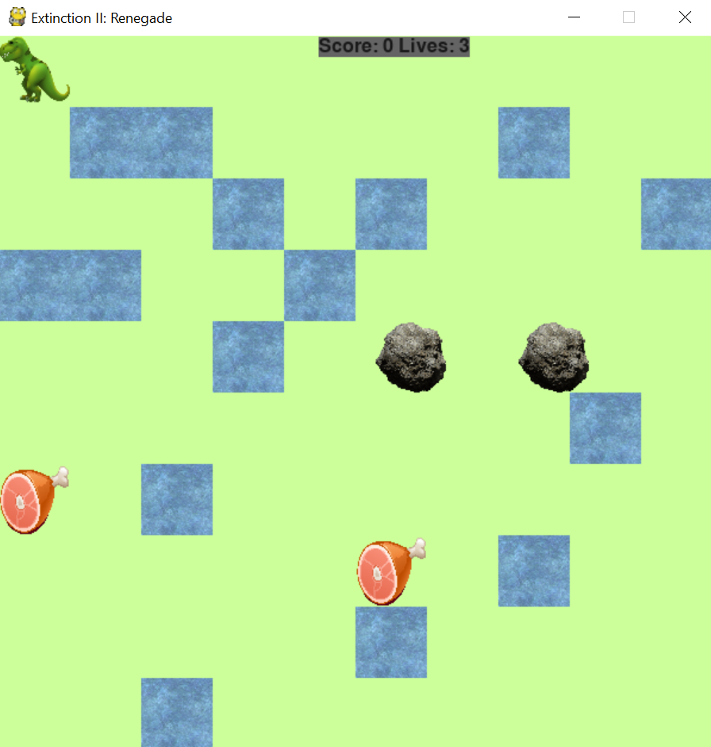

# extinction-ii-renegade

A top-down video game writted in Python using Pygame.

o	Used the PyGame Python library to design and implement a top-down video game using the Feature Driven Development (FDD) Agile methodology.

o	Incorporated fundamental principles of data structures and algorithms to program collision detection logic for player-to-enemy and player-to-reward events as well as pathfinding AI for enemy instances.

o	Exposure to GUI development using the TkInter library.

